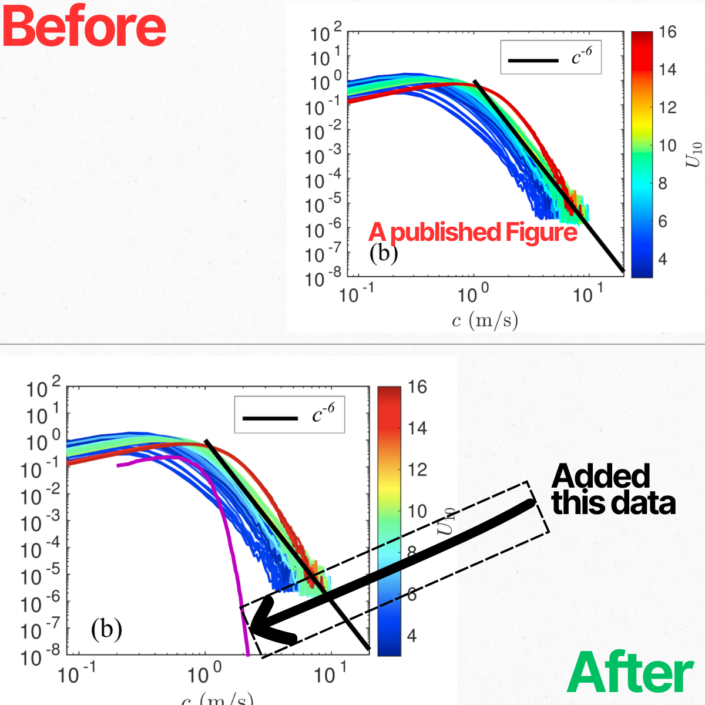

###     Overlay-New-Data-on-Published-Figures

Below is an example of an existing figure image (e.g. from a paper or report) before any new data is overlaid and the after.

This project provides a **reproducible Python workflow** for overlaying new data onto an existing figure image — including **published figures from papers, PDFs, theses, or reports** — even when the original plotting data is unavailable.

The figure is **calibrated once** by clicking known axis points.  
The calibration is saved to disk and reused indefinitely, allowing you to **replot, compare, and update overlays forever without clicking again**.

---

## Why this is useful

In research and engineering workflows, it is common to:
- Compare new experiments or simulations to **published figures**
- Reproduce or validate results from the literature
- Extend legacy plots when the original data is lost
- Work with figures extracted from PDFs or presentation slides

This tool turns a static figure image back into a **reusable plotting surface**, enabling accurate and scriptable comparisons.

---

## Key capabilities

- One-time interactive calibration using axis points  
- Save calibration to a JSON file for full reproducibility  
- Overlay and **compare new data directly against published figures**  
- Supports linear and logarithmic axes  
- Automatically clips overlays to the original figure range  
- Scriptable, batch-ready, and toolbox-quality  
- Produces publication-ready output using Matplotlib  

---

## Core idea

A plot image is just pixels.

By learning a mapping between  
**data space (x, y)** → **pixel space (u, v)**,  
new datasets can be overlaid accurately on top of an existing figure.

Once this mapping is calibrated, it never changes.

---

## Typical use cases

- Comparing new results to figures in journal papers  
- Reproducing plots when original data is unavailable  
- Validating models against published literature  
- Updating or extending legacy figures  
- Creating consistent visual comparisons across datasets  

## Video Tutorial

A full walkthrough of the workflow — including calibration, replay mode, and comparison with published figures — is available here:

**YouTube tutorial:** https://youtu.be/-oI3aeuZq9g

## Contributing

Contributions are welcome and encouraged!

If you have ideas to improve the code, fix bugs, add features, or improve documentation, please feel free to get involved.

### How to contribute
-  **Open an Issue** to report bugs, suggest enhancements, or discuss ideas
-  **Submit a Pull Request** with improvements, fixes, or new features
-  Improve documentation, examples, or usage instructions

### Guidelines
- Please keep pull requests focused and well-documented
- For major changes, consider opening an issue first to discuss the idea
- Follow existing code style where possible

By contributing, you agree that your contributions will be licensed under the MIT License.

Thank you for helping improve this project!

## License

MIT License

Copyright (c) 2025 Bernard Akaawase

Permission is hereby granted, free of charge, to any person obtaining a copy
of this software and associated documentation files (the "Software"), to deal
in the Software without restriction, including without limitation the rights
to use, copy, modify, merge, publish, distribute, sublicense, and/or sell
copies of the Software, and to permit persons to whom the Software is
furnished to do so, subject to the following conditions:

The above copyright notice and this permission notice shall be included in all
copies or substantial portions of the Software.

THE SOFTWARE IS PROVIDED "AS IS", WITHOUT WARRANTY OF ANY KIND, EXPRESS OR
IMPLIED, INCLUDING BUT NOT LIMITED TO THE WARRANTIES OF MERCHANTABILITY,
FITNESS FOR A PARTICULAR PURPOSE AND NONINFRINGEMENT. IN NO EVENT SHALL THE
AUTHORS OR COPYRIGHT HOLDERS BE LIABLE FOR ANY CLAIM, DAMAGES OR OTHER
LIABILITY, WHETHER IN AN ACTION OF CONTRACT, TORT OR OTHERWISE, ARISING FROM,
OUT OF OR IN CONNECTION WITH THE SOFTWARE OR THE USE OR OTHER DEALINGS IN THE
SOFTWARE.

